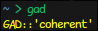
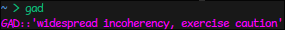
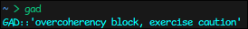

# GAD
This is a small program to display the current global ambient dissonance value. Mainly intended for use by
Mindspike contractors. Since most computers don't currently have the necessary hardware to compute this value, it is
fetched from an online API at https://state.corru.network.

## Usage
Grab a release binary from the releases page, and put it somewhere on your `PATH`. Then run `$ gad`.

## Preview
\
\

## I have no clue what any of this stuff means
Go play https://corru.observer!
